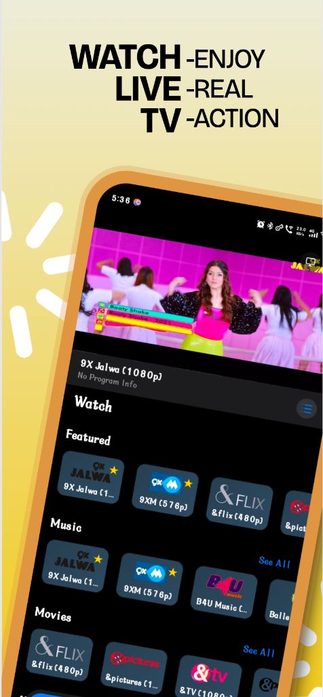
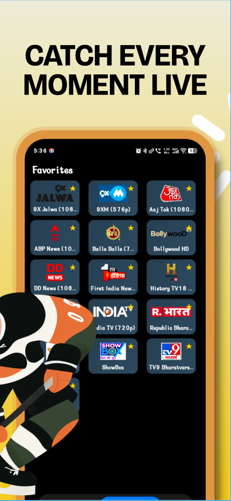
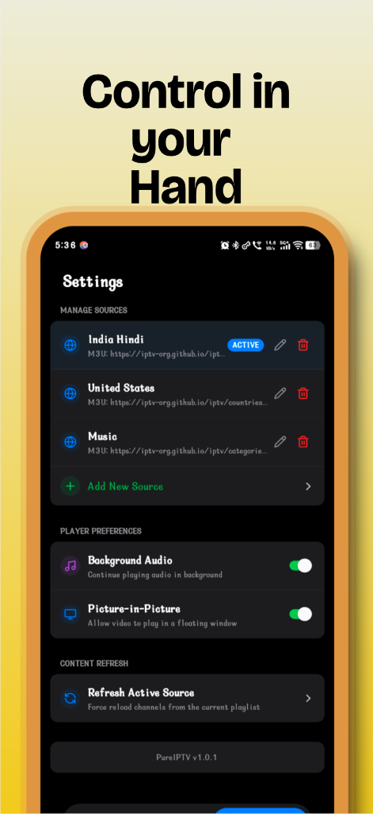
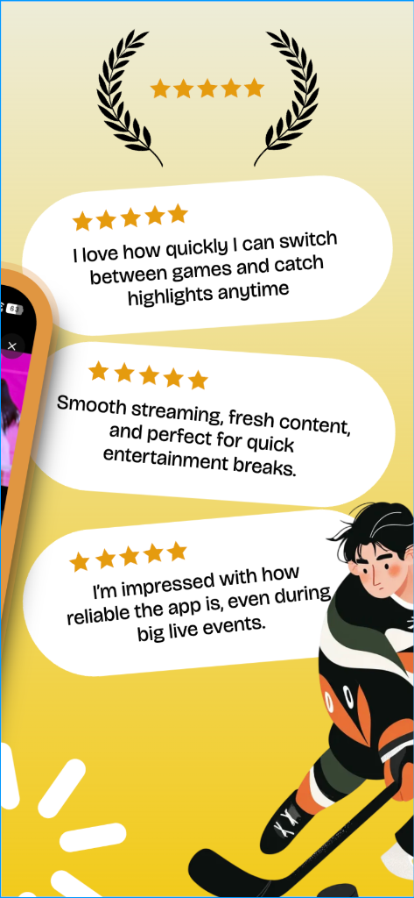

# PureIPTV v1.0.1

PureIPTV is a premium, high-performance IPTV client built for a modern, distraction-free viewing experience. Combining iOS-inspired aesthetics with elite performance, PureIPTV offers a seamless way to enjoy your favorite live channels.

## 📥 Download

**PureIPTV v1.0.1 (Android APK):**  
[Download Latest Build](https://github.com/daraptoor/PureIPTV/releases/download/v1.0.1/Pure.IPTV.Build.apk)

## 📸 Gallery

<p align="center">
  
  
  
</p>

## ✨ Premium Features

### 📺 Immersive Viewing Experience


- **Immersive Channels Mode**: Toggle off all UI controls (search, filters, layout switches) with a single tap for a clean, edge-to-edge channel grid.
- **Smart Sticky Header**: The "Watch Now" header intelligently sticks to the top during browsing but detaches when a video is active to maximize screen real estate.
- **Compact Global Player**: A refined, low-profile player interface that provides essential info and EPG data without obstructing the view.

<br clear="right"/>

### 🧭 Elite Navigation


- **Floating Pill Tab Bar**: A custom capsule-style navigation bar with glassmorphism effects, unique tab identities, and smooth active-state transitions.
- **Adaptive Safe Areas**: Full notch and status bar awareness across all screens, ensuring zero overlap and a "native" feel on every device.

<br clear="left"/>

### ⚙️ Total Control


- **Advanced Settings**: Manage multiple M3U sources, EPG URLs, and player preferences (PiP, Background Audio) with ease.
- **Refresh Control**: Force reload channels instantly from the current playlist.
- **Universal Favorites**: Easily manage your favorite channels with consistent styling across all views.

<br clear="right"/>

### 🌟 What Users Say
<p align="center">
  
</p>

### ⚡ Performance & Polish
- **Instant Search**: Optimized 150ms debounce for near-instant results filtering even in massive playlists.
- **Persistent Image Caching**: High-speed local caching of channel logos for instant load times on subsequent app launches.
- **Snappy Animations**: Custom easing and accelerated transitions for a responsive, high-end user experience.
- **Background Audio & PiP**: Full support for Picture-in-Picture and background audio playback, configurable via settings.

## 🛠 Technology Stack

- **Framework**: [Expo](https://expo.dev/) (React Native)
- **Styling**: [NativeWind](https://www.nativewind.dev/) (Tailwind CSS for React Native)
- **Icons**: [Lucide React Native](https://lucide.dev/)
- **State Management**: [Zustand](https://github.com/pmndrs/zustand)
- **Data Fetching**: [TanStack Query](https://tanstack.com/query/latest)
- **List Performance**: [@shopify/flash-list](https://github.com/Shopify/flash-list)
- **Video Engine**: [expo-video](https://docs.expo.dev/versions/latest/sdk/video/)

## 🚀 Getting Started

### Prerequisites
- Node.js (v18 or newer)
- npm or yarn
- Expo Go app on your mobile device (for development)

### Installation
1. Clone the repository:
   ```bash
   git clone https://github.com/daraptoor/PureIPTV.git
   cd PureIPTV
   ```
2. Install dependencies:
   ```bash
   npm install
   ```
3. Start the development server:
   ```bash
   npx expo start
   ```

## 📱 Release Notes (v1.0.1)
- Updated app identity to **PureIPTV**.
- Implemented **Smart Sticky Headers** and **Immersive Channels View**.
- Refined **Global Player** dimensions for a sleeker profile.
- Synchronized **Favorite Star** styling across all views.
- Enhanced **Safe Area** handling for better notched-device support.

---

Built with ❤️ by [Amit K](https://github.com/daraptoor)
